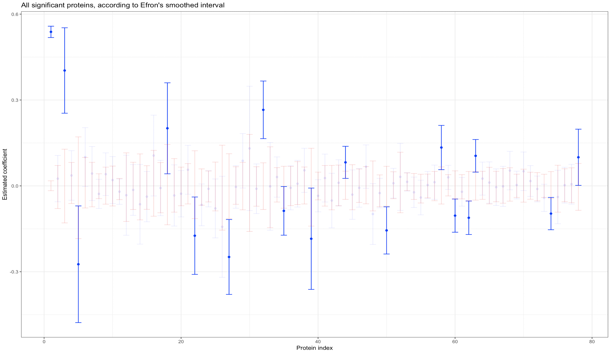
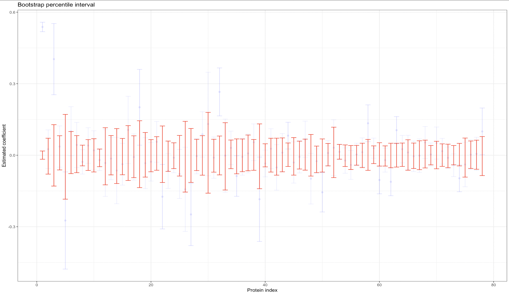

# P8160 Project 3: Bootstrapping Study

## Introduction

Bootstrapping offers a useful tool for investigating the empirical distribution of test statistics that have difficult distributions to derive. In high dimensional analyses, LASSO is a popular tool for variable selection, though infernce for LASSO coefficients is not as straightforward as ordinary least squares. In this study, we investigate the use of a bootstrapping technique by Efron et al in the prediction and model inference of Down Syndrome in mice. 

## The Models

Our bootstrapping algorithm uses a *majority vote* rule to create predictions. For a single bootstrap sample, a logistic-LASSO model is created, from which a set of bootstrap predictions is made for each mouse. Taking 1000 bootstrap samples means we have 1000 bootstrap predictions. 

## Results

Our bootstrapped model was adept at predicting the statuses of mice in a test dataset. Compared to our own implementation of logistic-LASSO which had a test accuracy of 90%, the bootstrapped majority prediction had a test accuracy of 98%

Our algorithm for calculating smoothed confidence intervals found 17 proteins to be significantly associated with Down Syndrome in the data set. We cross-referenced this list against the variables selected by a logistic-LASSO. We found that most of the significant proteins were indeed picked up by the variable selection. 

Contrast this against the bootstrap percentile intervals, which found no significant associations. 

## References

1. B. Efron. Model selection, estimation, and bootstrap smoothing. Technical Report Stanford University, (262), 2012.